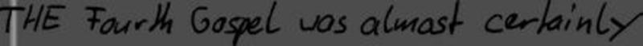
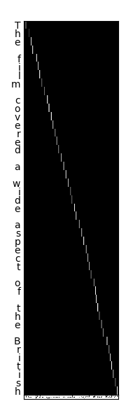

# Attention-OCR


Bidirectional LSTM encoder and attention-enhanced GRU decoder stacked on a multilayer CNN for image-to-transcription. 

This repository is associated with the paper ["Character-Based Handwritten Text Transcription with
Attention Networks"](https://arxiv.org/abs/1712.04046).

Please cite the paper if you use this code for academic research:

```
@article{DBLP:journals/corr/abs-1712-04046,
  author    = {Jason Poulos and
               Rafael Valle},
  title     = {Character-Based Handwritten Text Transcription with Attention Networks},
  journal   = {CoRR},
  volume    = {abs/1712.04046},
  year      = {2017},
  url       = {http://arxiv.org/abs/1712.04046},
  archivePrefix = {arXiv},
  eprint    = {1712.04046},
  timestamp = {Mon, 13 Aug 2018 16:47:16 +0200},
  biburl    = {https://dblp.org/rec/bib/journals/corr/abs-1712-04046},
  bibsource = {dblp computer science bibliography, https://dblp.org}
}
```

# Acknowledgements

This repo is forked from [Attention-OCR](https://github.com/da03/Attention-OCR) by [Qi Guo](http://qiguo.ml) and [Yuntian Deng](https://github.com/da03). The model is described in their paper [What You Get Is What You See: A Visual Markup Decompiler](https://arxiv.org/pdf/1609.04938.pdf). 

IAM image and transcription preprocessing from [Laia](https://github.com/jpuigcerver/Laia/).

# Prerequsites

### Python 3 (tested on Python 3.6.6)

### Tensorflow 1.14

### Required packages: {distance, ipdb, tqdm, pillow, matplotlib}:

```
pip3 install {package}
```

# Image-to-transcription on IAM:

### Data Preparation
Follow steps for [IAM data preparation](https://github.com/jpuigcerver/Laia/tree/iam_new/egs/iam#data-preparation). IAM consists of ~10k images of handwritten text lines and their transcriptions. The code in the linked repo binarizes the images in a manner that preserves the original grayscale information, converts to JPEG, and scales to 64 pixel height. The code creates a folder for preprocessed images `imgs_proc` and transcriptions `htr/lang/char`.


Create a file `lines_train.txt` from the transcription `tr.txt` that replaces whitespace with a vertical pipe and contains the path of images and the corresponding characters, e.g.:

```
./imgs_proc/a01-000u-00.jpg A|MOVE|to|stop|Mr.|Gaitskell|from
./imgs_proc/a01-000u-01.jpg nominating|any|more|Labour|life|Peers
./imgs_proc/a01-000u-02.jpg is|to|be|made|at|a|meeting|of|Labour
```
Also create file `lines_val.txt` from `htr/lang/word/va.txt` following the same format as above. 

Note: We assume that the working directory is `Attention-OCR`. The directory structure within `Attention-OCR` should be:

- `iamdb`
  - `imgs_proc`
  - `lines_train.txt`
  - `lines_val.txt`
  - `lines_test.txt`

### Train

```
python3 src/launcher.py \
--phase=train \
--data-path=lines_train.txt \
--data-base-dir=iamdb \
--model-dir=model_iamdb_softmax \
--log-path=log_iamdb_train.txt \
--reg-val=1 \
--attn-num-hidden 256 \
--batch-size=4 \
--num-epoch=200 \
--steps-per-checkpoint=500 \
--opt-attn=softmax \
--target-embedding-size=100 \
--target-vocab-size=95 \
--initial-learning-rate=1 \
--use-gru \
--no-load-model
```

You will see something like the following output in `log_iamdb_train.txt`:

```
...
2017-05-04 19:15:44,919 root  INFO     Created model with fresh parameters.
2017-05-04 19:17:22,927 root  INFO     Generating first batch
2017-05-04 19:17:41,591 root  INFO     step 0.000000 - time: 14.091797, loss: 4.537364, perplexity: 93.444157, precision: 0.000000, batch_len: 438.000000
2017-05-04 19:17:43,527 root  INFO     step 1.000000 - time: 1.669232, loss: 4.370135, perplexity: 79.054328, precision: 0.000000, batch_len: 416.000000
2017-05-04 19:17:45,266 root  INFO     step 2.000000 - time: 1.706899, loss: 4.140279, perplexity: 62.820334, precision: 0.000000, batch_len: 404.000000
2017-05-04 19:17:46,947 root  INFO     step 3.000000 - time: 1.609537, loss: 3.799597, perplexity: 44.683175, precision: 0.000000, batch_len: 395.000000
2017-05-04 19:17:48,831 root  INFO     step 4.000000 - time: 1.846071, loss: 3.457146, perplexity: 31.726298, precision: 0.000000, batch_len: 478.000000
2017-05-04 19:17:50,711 root  INFO     step 5.000000 - time: 1.644378, loss: 3.301664, perplexity: 27.157789, precision: 0.000000, batch_len: 463.000000
2017-05-04 19:17:52,411 root  INFO     step 6.000000 - time: 1.674972, loss: 3.396979, perplexity: 29.873725, precision: 0.000000, batch_len: 458.000000
2017-05-04 19:17:54,271 root  INFO     step 7.000000 - time: 1.675854, loss: 3.489168, perplexity: 32.758671, precision: 0.000000, batch_len: 432.000000
2017-05-04 19:17:55,950 root  INFO     step 8.000000 - time: 1.601847, loss: 3.292296, perplexity: 26.904564, precision: 0.000000, batch_len: 441.000000
2017-05-04 19:17:57,776 root  INFO     step 9.000000 - time: 1.704575, loss: 3.170712, perplexity: 23.824447, precision: 0.000000, batch_len: 429.000000
2017-05-04 19:17:59,280 root  INFO     step 10.000000 - time: 0.817045, loss: 3.181931, perplexity: 24.093222, precision: 0.000000, batch_len: 419.000000

```

Model checkpoints saved in `model` (the output directory is set via parameter `model-dir` and the default is `model`).

## Test model and visualize attention

We provide a trained model on IAM:

```
wget https://www.dropbox.com/s/ujxeahr1voo0sl8/model_iamdb_softmax.tar.gz
```

```
tar -xvzf model_iamdb_softmax.tar.gz
```

```
python3 src/launcher.py \
--phase=test \
--visualize \
--data-path=lines_test.txt \
--data-base-dir=data \
--model-dir=model_iamdb_softmax \
--log-path=log_iamdb_test.txt \
--reg-val=1 \
--batch-size=4 \
--num-epoch=200 \
--steps-per-checkpoint=500 \
--opt-attn=softmax \
--target-embedding-size=100 \
--target-vocab-size=95 \
--use-gru \
--load-model \
--output-dir=softmax_results
```

You will see something like the following output in `log_iamdb_val.txt`:

```
2017-05-04 20:06:32,116 root  INFO     Reading model parameters from model_iamdb_softmax/translate.ckpt-731000
2017-05-04 20:09:54,266 root  INFO     Compare word based on edit distance.
2017-05-04 20:09:57,299 root  INFO     step_time: 2.684323, loss: 12.952633, step perplexity: 421946.118697
2017-05-04 20:10:10,894 root  INFO     0.489362 out of 1 correct
2017-05-04 20:10:11,710 root  INFO     step_time: 0.779765, loss: 16.425102, step perplexity: 13593499.165457
2017-05-04 20:10:22,828 root  INFO     0.771970 out of 2 correct
2017-05-04 20:10:23,627 root  INFO     step_time: 0.776458, loss: 20.803520, step perplexity: 1083562653.786069
2017-05-04 20:10:47,098 root  INFO     1.423133 out of 3 correct
2017-05-04 20:10:48,040 root  INFO     step_time: 0.918638, loss: 11.657264, step perplexity: 115527.486132
2017-05-04 20:11:04,398 root  INFO     2.246663 out of 4 correct
2017-05-04 20:11:07,883 root  INFO     step_time: 3.448558, loss: 10.126567, step perplexity: 24998.394628
2017-05-04 20:11:25,554 root  INFO     2.483505 out of 5 correct
2017-05-04 20:11:26,439 root  INFO     step_time: 0.846741, loss: 19.127279, step perplexity: 202708446.724307
2017-05-04 20:11:54,204 root  INFO     3.203505 out of 6 correct
2017-05-04 20:11:55,547 root  INFO     step_time: 1.328614, loss: 14.361533, step perplexity: 1726372.881045
2017-05-04 20:12:16,062 root  INFO     3.586483 out of 7 correct
2017-05-04 20:12:16,933 root  INFO     step_time: 0.846231, loss: 13.471820, step perplexity: 709148.247623
2017-05-04 20:12:53,892 root  INFO     4.261483 out of 8 correct
2017-05-04 20:12:55,135 root  INFO     step_time: 1.206629, loss: 8.952523, step perplexity: 7727.365214
2017-05-04 20:13:24,057 root  INFO     5.025120 out of 9 correct
2017-05-04 20:13:24,860 root  INFO     step_time: 0.770344, loss: 17.900974, step perplexity: 59469508.304005

```

Output images in `softmax_results` (the output directory is set via parameter `output-dir` and the default is `results`). This example visualizes attention on an image:



This example plots the attention alignment over an image:



### Parameters:

Default parameters set in the file `src/exp_config.py`.

- Control
    * `GPU-ID`: ID number of the GPU. Set to 2 if using 2 GPUs. Default is 0. 
    * `phase`: Determine whether to 'train' or 'test'. Default is 'test'.
    * `visualize`: Valid if `phase` is set to test. Output the attention maps on the original image.
    * `load-model`: Load model from `model-dir` or not.
    * `target-vocab-size`: Target vocabulary size. Default is = 26+10+3 # 0: PADDING, 1: GO, 2: EOS, >2: 0-9, a-z

- Input and output
    * `data-base-dir`: The base directory of the image path in `data-path`. If the image path in `data-path` is absolute path, set it to `/`.
    * `data-path`: The path containing data file names and labels. Format per line: `image_path characters`.
    * `model-dir`: The directory for saving and loading model parameters (structure is not stored). Default is 'train'.
    * `log-path`: The path to put log. Default is 'log.txt'
    * `output-dir`: The path to put visualization results if `visualize` is set to True. Default is 'results'.
    * `steps-per-checkpoint`: Checkpointing (print perplexity, save model) per how many steps. Default is 500. 

- Optimization
    * `num-epoch`: The number of whole data passes. Default is 1000. 
    * `batch-size`: Batch size. Only valid if `phase` is set to train. Default is 64.
    * `initial-learning-rate`: Initial (AdaDelta) learning rate. Default is 1. 

- Network
    * `reg-val`: Lambda for L2 regularization losses. Default is 0. 
    * `clip-gradients`: Whether to perform gradient clipping. Default is 'True'.
    * `max-gradient-norm`: Clip gradients to this norm. Default is 5. 
    * `target-embedding-size`: Embedding dimension for each target. Default is 10. 
    * `opt-attn`: Which attention mechanism to use: 'softmax' (default); 'log_softmax'; 'sigmoid'; 'no_attn'.
    * `use-gru`: Use GRU for decoder (rather than LSTM). Default is 'True'.
    * `attn-num-hidden`: Number of hidden units in attention decoder cell. Default is 128. 
    * `attn-num-layers`: Number of layers in attention decoder cell. Default is 2. (Encoder number of hidden units will be `attn-num-hidden`*`attn-num-layers`).